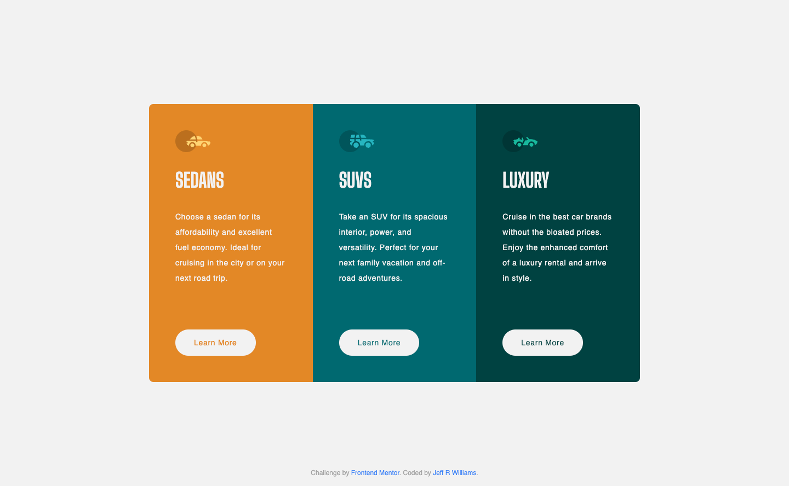
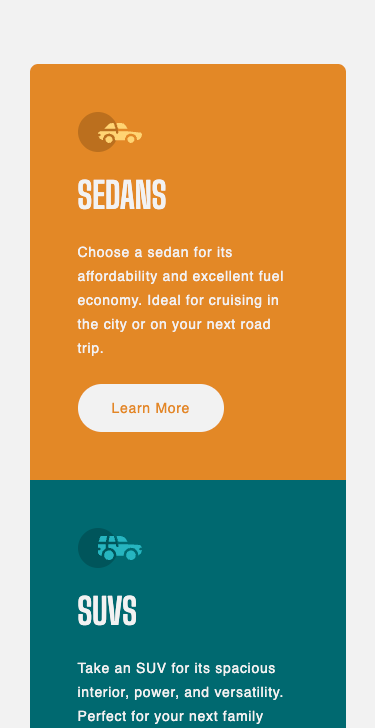

# Frontend Mentor - 3-column preview card component solution

This is a solution to the [3-column preview card component challenge on Frontend Mentor](https://www.frontendmentor.io/challenges/3column-preview-card-component-pH92eAR2-). Frontend Mentor challenges help you improve your coding skills by building realistic projects.

## Table of contents

- [The challenge](#the-challenge)
- [Screenshot](#screenshot)
- [Links](#links)
- [Built with](#built-with)
- [Author](#author)

## The challenge

Users should be able to:

- View the optimal layout depending on their device's screen size
- See hover states for interactive elements

## Screenshot

## Links

- Solution URL: [Github Repo](https://github.com/orphandeity/3-column-preview-card-component.git)
- Live Site URL: [GitHub Pages](https://orphandeity.github.io/3-column-preview-card-component)

## Built with

- [React](https://reactjs.org/) - JS library
- [Vite](https://vitejs.dev/) - React framework
- [TailwindCSS](https://tailwindcss.com/) - For styles

## Author

- Frontend Mentor - [@orphandeity](https://www.frontendmentor.io/profile/orphandeity)
